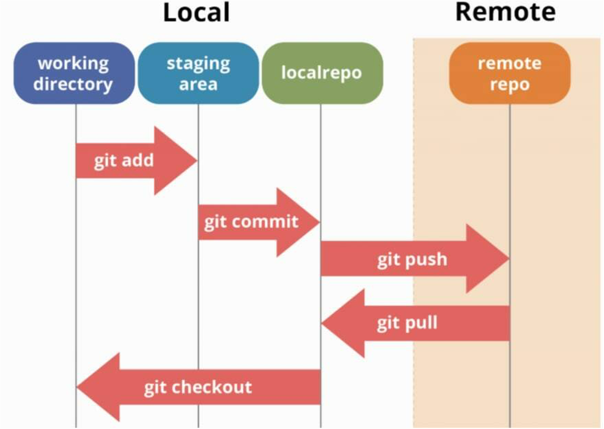

# Git Workshop

This repo belongs to Rita Cunha


# 1. What is Git?

Git is officially defined as a *distributed version control system* (VCS).

In other words, it's a system that tracks changes to our project files over time. It enables us to record project changes and go back to a specific version of the tracked files, at any given point in time.  This system can be used by many people to efficiently work together and **collaborate on team projects**, where each developer can have their own version of the project, distributed on their computer. Later on, these individual versions of the project can be merged and adapted into the main version of the project.

Basically, it's a massively popular tool for coordinating parallel work and managing projects among individuals and teams. Needless to say, knowing how to use Git is one of the most important skills for any developer nowadays - and it's definitely a great addition to your resume!


ℹ️ Git official homepage: [https://git-scm.com/](https://git-scm.com/)

## 1.1. Repositories

When working with Git, it's important to be familiar with the term **repository**. A Git repository is a container for a project that is tracked by Git.  

We can single out two major types of Git repositories:

- **Local repository** - an isolated repository stored on your own computer, where you can work on the local version of your project.
- **Remote repository** - generally stored outside of your isolated local system, usually on a remote server. It's especially useful when working in teams - this is the place where you can share your project code, see other people's code and integrate it into your local version of the project, and also push your changes to the remote repository.


## 1.2. Basic Git Workflow

Below is a general overview of the most important commands we need to be familiar with when using git, and how they all relate to each other. Don't worry if this doesn't make sense just yet, we'll get there.




Let's discuss the diagram briefly.
After the user makes changes on the working file, git takes notice of the recently modified files. The modified files are **added** to a staging area which acts as the temporary location for the files.

All the staged files are ready to be **committed/moved** to a local repository. Up to this point the changes are only visible on the developer’s local machine and cannot be accessed by other contributors online. To make the file available online, you need to host an online hosting service such as GitHub, where you can **push** the local changes and sync it with the remote repository.

Imagine now that the other contributors have pushed changes to the remote repository. You must sync your local repository with the remote repository to be up-to-date with the changes done. To do that you use a **pull** command.

## 1.3. Branching

**Branching** simply means creating a different line of development, known as a branch, where you can test and experiment new things before implementing them into the main codebase. Thus, using branches will save you from messing up with production codebase.

After testing the new changes on the branch, you can integrate them with the main line of development. This act of integrating the branches to the main line of development is known as **merging**.


# 2. Setup Instructions 

If you haven't installed Git previously, follow the instructions on this link: [Install Git on Linux/MacOS/Windows](https://git-scm.com/book/en/v2/Getting-Started-Installing-Git)

Git is primarily used via the command-line interface, which we can access with our system terminals. However, there is a GUI interface for it called Github Desktop, easier to use.

Github Desktop can be installed by following this [link](https://desktop.github.com)

# 3. Hands-on with Git & Github

## 3.1. Initializing a repository

To create a new repository and start tracking your project with Git, use your terminal software and navigate to the main folder of your project, then type the following command:

```bash
git init
```

This command will generate a hidden **.git** directory for your project, where Git stores all internal tracking data for the current repository.


Alternatively, you may want to use a repository that was already created by someone else and is available to be cloned. In this tutorial we will be using the Colab Template, which we have previously prepared for you. Start by clicking in 'Use this template':


Then, create a repository in your profile from this template:


And you've just successfully created your first **remote** repository! Now it's time to **clone** it into your computer, meaning you're going to create a local copy where you can perform changes! In order to do this simply go to the folder you would like to place your new project in and type the following command, replacing <username> with your username:

```bash
git clone git@github.com:<username>/Git_Workshop.git
```

If all went well you should now see a folder similar to the following:


We are ready to learn git now :)


## 3.2. Staging and committing code

Have another look at the diagram above. Committing is the process in which the changes are *'officially'* added to the Git repository.

In Git, we can consider **commits** to be checkpoints, or snapshots of your project at its current state. In other words, we basically save the current version of our code in a commit. We can create as many commits as we need in the commit history, and we can go back and forth between commits to see the different revisions of our project code. That allows us to efficiently manage our progress and track the project as it gets developed.

Commits are usually created at logical points as we develop our project, usually after adding in specific contents, features or modifications (like new functionalities or bug fixes, for example).


📌 Before we can commit our code, we need to place it inside the **staging area**.


## 3.3. Checking the status

While located inside the project folder in our terminal, we can type the following command to check the status of our repository:

```bash
git status
```

This is a command that is very often used when working with Git.  It shows us which files have been changed, which files are tracked, etc.

We can add the untracked project files to the **staging area** based on the information from the `git status` command.

At a later point, `git status` will report any modifications that we made to our tracked files before we decide to add them to the staging area again.

## 3.4. Staging files

From the project folder, we can use the **git add** command to add our files to the staging area, which allows them to be tracked.

We can add a specific file to the staging area with the following command:

```bash
git add file.js
```

To add multiple files, we can do this:

```bash
git add file.js file2.js file3.js
```
 
Instead of having to add the files individually, we can also add all the files inside the project folder to the staging area:
```bash
git add .
```
 
By default, this adds **all the files and folders** inside the project folder to the staging area, from where they are ready to be committed and tracked.  

## 3.5. Making commits

 A **commit** is a snapshot of our code at a particular time, which we are saving to the commit history of our repository. After adding all the files that we want to track to the staging area with the `**git add`** command, we are ready to make a commit.

To commit the files from the staging area, we use the following command:

```bash
git commit -m "Commit message"
```

Inside the quotes, we should write a **commit message** which is used to identify it in the commit history. The commit message should be a descriptive summary of the changes that you are committing to the repository.

After executing that command, you will get the technical details about the commit printed in the terminal. And that's basically it, you have successfully made a commit in your project!

📌 To create a new commit, you will need to repeat the process of adding files to the staging area and then committing them after. Again, it's very useful to use the **git status** command to see which files were modified, staged, or untracked.

## 3.6. Commit history

To see all the commits that were made for our project, you can use the following command:

```bash
git log
```

The logs will show details for each commit, like the author name, the generated hash for the commit, date and time of the commit, and the commit message that we provided.

To go back to a previous state of your project code that you committed, you can use the following command:

```bash
git checkout <commit-hash>
```

Replace `<commit-hash>` with the actual hash for the specific commit that you want to visit, which is listed with the `git log` command.
 
## 3.6. Branches

A **branch** could be interpreted as an individual timeline of our project commits. With Git, we can create many of these alternative environments (i.e. we can create different **branches**) so other versions of our project code can exist and be tracked in parallel. That allows us to add new (experimental, unfinished, and potentially buggy) features in separate branches, without touching the '*official'* stable version of our project code (which is usually kept on the **main** branch).

When we initialize a repository and start making commits, they are saved to the **main** branch by default.

### 3.6.1. Creating a new branch

You can create a new branch using the following command:

```bash
git branch -b <new-branch-name>
```

The new branch that gets created will be the reference to the current state of your repository.

### 3.6.2. Changing branches

To switch to a different branch, you use the **git checkout** command:

```bash
git checkout <branch-name>
```

With that, you switch to a different isolated timeline of your project by changing branches.

📌 For example, you could be working on different features in your code and have a separate branch for each feature. When you switch to a branch, you can commit code changes which only affect that particular branch. Then, you can switch to another branch to work on a different feature, which won't be affected by the changes and commits made from the previous branch.
 
 ℹ️ To list the branches for your project, use this command: `git branch`

### 3.6.3. Merging branches

You can merge branches in situations where you want to implement the code changes that you made in an individual branch to a different branch. For example, after you fully implemented and tested a new feature in your code, you would want to merge those changes to the stable branch of your project (which is usually the default **main** branch).

To merge the changes from a different branch into your current branch, you can use this command:

```bash
git merge <branch-name>
```

You would replace `<branch-name>` with the branch that you want to integrate into your current branch.

### 3.6.4. Deleting a branch

To delete a branch, you can run the **git branch** command with the **-d** flag:

```bash
git branch -d <branch-name>
```

ℹ️ Read more about branching and merging [on this link](https://git-scm.com/book/en/v2/Git-Branching-Basic-Branching-and-Merging).

# 4. Ignoring files

To ignore files that you don't want to be tracked or added to the staging area, you can create a file called `.gitignore` in your main project folder.

Inside of that file, you can list all the file and folder names that you definitely do not want to track (each ignored file and folder should go to a new line inside the **.gitignore** file).

You can read an article about ignoring files [on this link](https://help.github.com/en/articles/ignoring-files).

# 5. Further learning

To learn more about Git, make sure to check the following resources:

- Git official documentation: [https://git-scm.com/doc](https://git-scm.com/doc)
- The free **Pro Git** book: [https://git-scm.com/book/en/v2](https://git-scm.com/book/en/v2)
- Learn about GitHub: [https://guides.github.com/](https://guides.github.com/)


ℹ️ GitHub is a website where we can store our repositories online. In other words, GitHub works with Git as a repository hosting service.
 
# 6. Acknowledgements
 
This workshop was based on:
 
 - [Introduction-to-Git](https://www.notion.so/zarkom/Introduction-to-Git-ac396a0697704709a12b6a0e545db049)
 - [Git ang Github for beginners](https://dev.to/ericawanja/git-and-github-for-beginners-33a0)
 
<!--
### Configuring Your Name & Email

In your terminal, run the following commands to identify yourself with Git:

```bash
git config --global user.name "Your Name"
git config --global user.email "your@email.com"
```

Replace the values inside the quotes with your name and email address. -->

